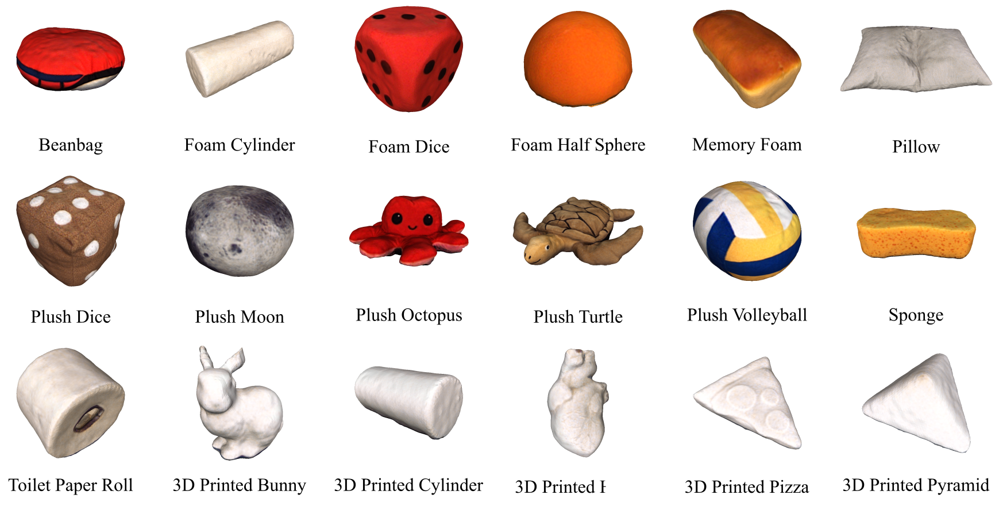

# **PokeFlex:** A Real-World Dataset of Volumetric Deformable Objects for Robotics

<div>
    <a href="https://arxiv.org/abs/2410.07688" target="_blank">
        
    </a>
    <a href="https://pokeflex-dataset.github.io/" target="_blank">
        
    </a>
    <a href="https://github.com/pokeflex-dataset/reconstruction" target="_blank">
        
    </a>
</div>

---

## Overview

**PokeFlex** is a comprehensive real-world dataset of volumetric deformable objects designed to advance robotics
research and applications. It provides a unique combination of multimodal data and tools, offering several key
contributions:

- **Rich Multimodal Dataset**: Includes 18 deformable objects with synchronized RGB-D data from eye-in-hand and
  eye-on-hand sensors, high-resolution 3D reconstructed textured meshes, and detailed robot data such as joint angles,
  end-effector poses, and force-torque measurements.
- **Simulation-Ready Assets**: Provides assets and resources for integrating the dataset into common physics simulators,
  enabling physics-based simulations.
- **Benchmarks for Deformation Prediction**: Features benchmarks for real-time deformation prediction from diverse
  modalities.
- 
### Examples

| **Action**   | **Foam Dice**                                                   | **Plush Dice**                     | **3D Printed Bunny**                                             | **Foam Cylinder**                                               | **Plush Octopus**                                                  |
|--------------|-----------------------------------------------------------------|-------------------------------------|------------------------------------------------------------------|-----------------------------------------------------------------|--------------------------------------------------------------------|
| **Poking**   |    |        |    |    |    |
| **Dropping** |  |        |  |  |  |

### Objects


---

## Getting Started
### 1. Clone the repository

```bash
git clone https://github.com/pokeflex-dataset/reconstruction
```


### 2. Python Environment Setup

Follow these steps to set up the required environment:

Create and activate the conda environment:
```bash
conda create -n pokeflex python=3.11
conda activate pokeflex
```

Install PyTorch with CUDA support:
```bash
conda install pytorch=2.1.0 torchvision pytorch-cuda=12.1 -c pytorch -c nvidia
```

Install additional dependencies:
```bash
pip install -U 'git+https://github.com/facebookresearch/iopath'
conda install jupyter
pip install scikit-image matplotlib imageio plotly opencv-python
conda install -c fvcore -c conda-forge fvcore
pip install black usort flake8 flake8-bugbear flake8-comprehensions
```

Install PyTorch3D:
```bash
conda install pytorch3d -c pytorch3d
```

Install remaining dependencies:
```bash
pip install trimesh pyvista meshio siren-pytorch open3d pyyaml numpy==1.26.4 transformers
```

### 3. Get the data
The dataset can be found [here.](https://pokeflex.ait.ethz.ch/)

Supplementary material can be downloaded [here.](https://drive.google.com/drive/folders/17zndHnoIuzzQmDNInpVKo9l8nEVcs1pb?usp=sharing)


### 4. Preprocess the data for training

1. Configure the preprocessing settings in the [config/preprocess.yml](config/preprocessing.yml) file.
2. Run the following command to preprocess the data:

```bash
python3 dataset/preprocess.py
```

### 5. Training
1. Set training parameters in the respective .yml config file according to the chosen modality.
2. Start training using the following command:

```bash
python3 main.py --modality <modality> 
```

## Citation

```bibtex
@article{obrist2024pokeflex,
      author    = {Obrist, Jan and Zamora, Miguel and Zheng, Hehui and Hinchet, Ronan and Ozdemir, Firat and Zarate, Juan and Katzschmann, Robert K. and Coros, Stelian},
      title     = {PokeFlex: A Real-World Dataset of Deformable Objects for Robotics},
      journal   = {Under review},
      year      = {2025}
      url       = {https://arxiv.org/pdf/2410.07688}
      }
```
